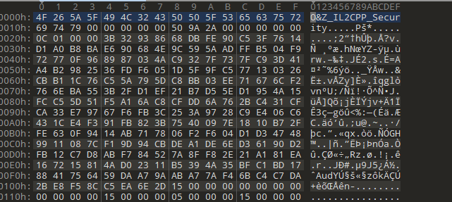

# Ether-IL2CPP

**中文文档[请戳我](README_zh-cn.md)**

## Support Unity Version

| Il2Cpp Version | Unity Version                | Support        |
| -------------- | ---------------------------- |--------------  |   
| 24.0           | 2017.x - 2018.2.x            |                |
| 24.1           | 2018.3.x - 2018.4.x          |                |
| 24.2           | 2019.1.x - 2019.2.x          |                |
| 24.3           | 2019.3.x, 2019.4.x, 2020.1.x |✔️             |
| 24.4           | 2019.4.x and 2020.1.x        |✔️             |
| 27.0           | 2021.2.x                     |                |
| 27.1           | 2020.2.x - 2020.3.x          |                |
| 27.2           | 2021.1.x, 2021.2.x           |                |
| 28             | 2021.3.x, 2022.1.x           |✔️             |

If you need to know the `Metadata Version` you use, you can use the `CheckVersion` parameter to view your metadata version *(You can get more details below)*

***If you want us to add support for the Unity version you use, you can contact my email(2286401259@qq.com) or put forward in the issue***

## How will we encrypt your program
1. We redefined and declared new `Header`, and hid them in the file after encryption, making it difficult for the cracker to obtain the original headers（This change is based on Article 4）
2. Encrypt the `String` in the **Metadata** to prevent key class and method names from being obtained, which is also applicable to prevent IL2CPPDummper attacks (even if the header confusion fails, it can also provide secondary protection)
3. Encrypt the `StringLiteral` in the **Metadata** to prevent your game text or string key and other key strings from being attacked
4. We confuse `Header` and hide key parameters such as `Sanity` and `Verison`, which makes IL2CPPDumper and other software unable to correctly identify metadata files

## Encryption effect
After Il2CPP Dumper

Even if the hacker cracked the header confusion, your program is still in the confusion state

Dump.cs obtained by hackers

Origin Header

Our Header

## How to use Ether-IL2CPP
1. Download our program on the Release pagepage,or you can clone our project and compile it yourself
2. Configure your metadata version correctly in `Config.json` *(You can view the comparison chart between `Metadata version` and `Unity version` above)*
   >Or you can use the `CheckVersion` parameter to view your metadata version(You need to build your project once in advance to get the original **Metadata**)

~~~
O&Z_IL2CPP_Security Input CheckVersion

For exzample:
O&Z_IL2CPP_Security global-metadata.dat CheckVersion
~~~

1. First, you need to configure a key to encrypt the metadata **(The key cannot exceed the upper limit of `int`)**
   >

2. Use the `Generate` parameter to generate supporting encryption components

~~~
Ether-Uprotector.exe Generate
~~~

>After successful generation, you can find the generated encryption component in **`Generation\Your Metadata Version\`** (⚠the component is `the entire directory`!)

>

>***tips: The `src-res` folder contains the component model. Please do not modify or move it to prevent errors***

3. Overwrite the original folder with the newly generated folder (**\Unity XXXXX\Editor\Data\il2cpp\libil2cpp\\**)

4. Rebuild your project in Unity
5. Extract the generated **Metadata(global-metadata.dat)**，Use the `Crypt` parameter to encrypt this file
~~~
"Ether-Uprotector.exe" input Crypt output

For exzample:

"Ether-Uprotector.exe" "global-metadata.dat" Crypt "global-metadata.dat.crypted"
~~~
1. Rename the encrypted output file to the name of the original Metadata and replace the original Metadata
2. Enjoy the safety of **Ether-IL2CPP**!: D