# Ether Obfuscator

## 可使用的功能

|                       |说明|
|--------------------------|----|
|ControlFlow               |控制流程加密 |
|NumObfus                  |整数预设混淆|
|LocalVariables2Field      |局部变量混淆为字段|
|StringCrypt               |字符串加密|
|ObfusFunc                 |类&方法&字段混淆(支持MonoBehaviour)|
|Anti De4dot               |使得反混淆器失效|
|Anti Anti-ILDASM          |使得反汇编器失效(不支持IL2CPP)|
|PEPacker                  |去除NET标志使得ILSpy，DnSpy等软件无法正确识别NET程序集(不支持IL2CPP)|
|ErrorMethod               |加固方法使得Dnspy等反编译器无法还原您的代码|

> 在下方查看详细介绍以及使用方法
> 
## 使用方法
1. 下载UnityPackage([下载请点击我](https://github.com/Z1029-oRangeSumMer/O-Z-IL2CPP/releases))并导入到您的项目中
2. 如果您是第一次使用，请在Unity顶部找到Ether-GenerateConfi
   
   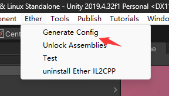

   插件会自动分析您的项目并且生成相应的配置文件,您可以对生成的文件进行二次手工配置

   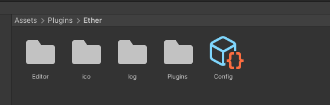
3. 在Config文件中打开Enable开关，并在下方的Obfuscations中选择你需要的功能([功能介绍](#加密功能说明))
   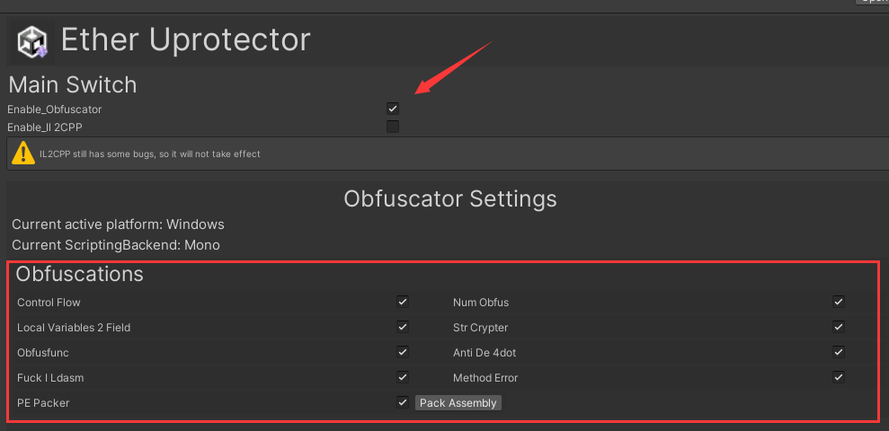
4. 您现在可以直接构建您的项目，就像平常一样，我们的插件会帮你自动完成接下来的一切
5. 如果后续对工程进行了修改，你可以在Config文件中进行[直接配置(自动)](#关于自动配置)

## 关于自动配置
 - GUIResolver
   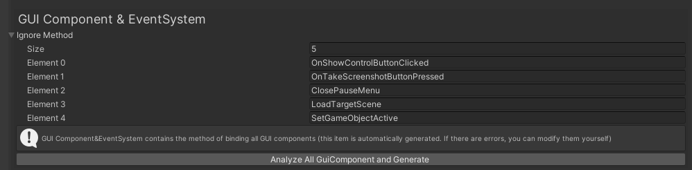
   GUI_Ignore中包含了所有的GUI组件以及EventSystem所绑定的方法，如果您的项目发生了更改，您可以点击`Analyze All`按钮来重新分析您的项目，GUIResolver会自动分析您项目中所有的GUI组件并生成IgnoreList
 - AnimationResolver
   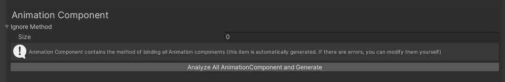
   Animation_Ignore中包含了所有Animation组件所绑定的方法，如果您的项目发生了更改，您可以点击`Analyze All`按钮来重新分析您的项目，AnimationResolver会自动分析您项目中所有的Animation组件并生成IgnoreList
 - ReflectionResolver
   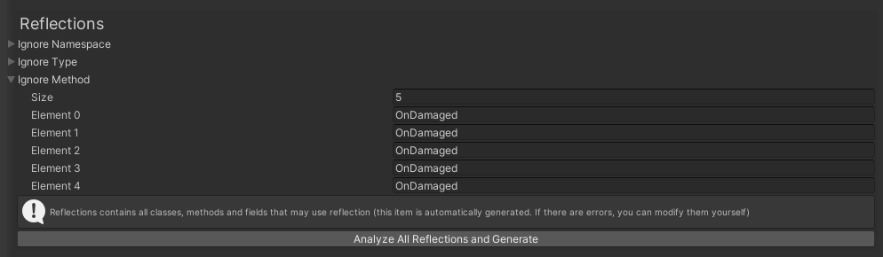
   Reflection_Ignore中包含了我们分析出所有可能存在的反射(方法，类以及命名空间)，您可以点击`Analyze All`按钮来重新分析您的项目，ReflectionResolver会自动分析您程序集中所有的反射并生成IgnoreList

## 注意事项
 - Native层里直接调用C#或通过Unity内置API发送事件到C#的类和方法不可混淆(大多数在移动平台中)
 - 一些特殊插件对应的脚本不可混淆，例如xLua和与之绑定的C#脚本
 - 你可以将特殊的类名放到Custom_Ignore_List中，插件会自动忽略它们
   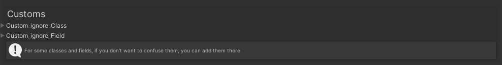
 - 关于PEPacker功能,我们目前暂时仅对Windows平台的Mono编译提供自动加固(Android平台或者其他平台的Mono编译请自行使用PEPack功能对程序集进行加固，**同时记得对您的apk进行二次签名**)
   
   > Android平台需要先对apk进行解压，找到Assmebly-CSharp.dll，使用手动的方法对它进行加固，同时二次打包您的apk并且签名
   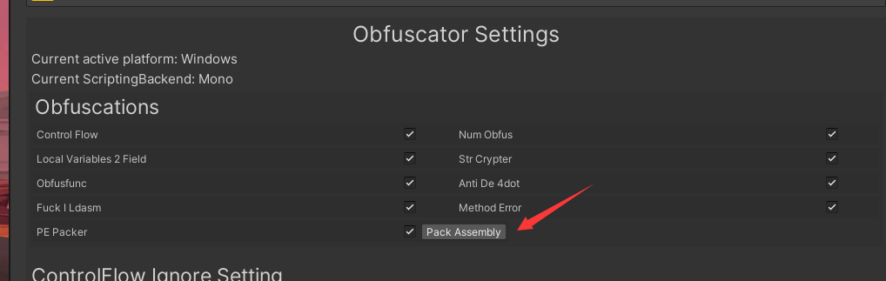

## 关于Ether_Obfuscator问题处理
1. ControlFlow功能可能存在bug,如果Unity抛出异常，可以尝试关闭ControlFlow功能
2. 如果在IL2CPP构建过程中个别方法抛出异常
   
   可以将HandleShoot函数添加到**ignore_ControlFlow_Method**中
   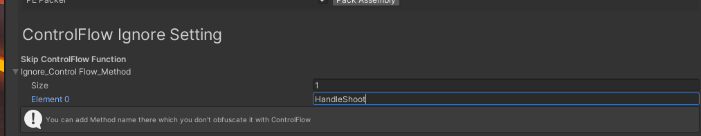

## 加密功能说明
 - ControlFlow(控制流程加密)

   使用本方法将对您的程序函数方法进行流程混淆，不改变执行流程，但是可以打乱编译流程以及IL码的顺序，可以做到干扰破解
   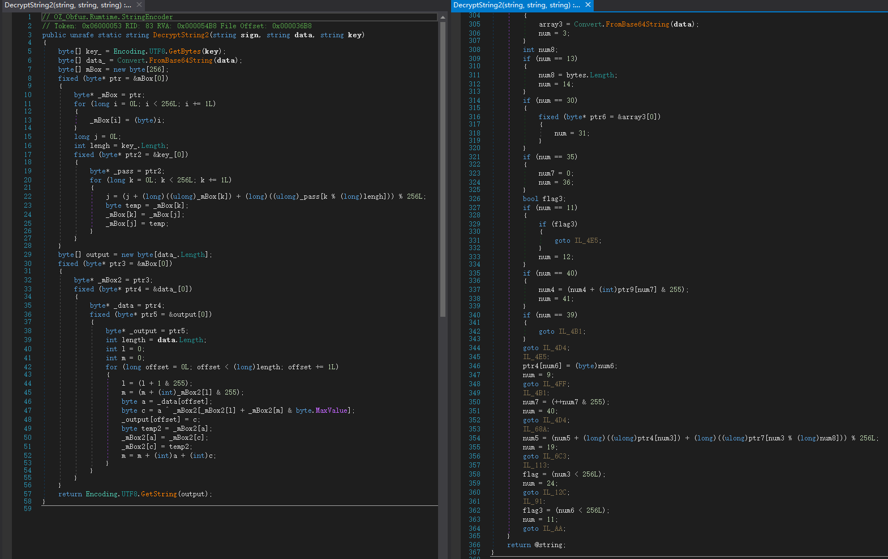

 - NumObfus(整数预设混淆)
  
   使用本方法将加密您程序集中的所有int类型预设常量（即明文数据，例如int num = 8, 8即为预设常量）
   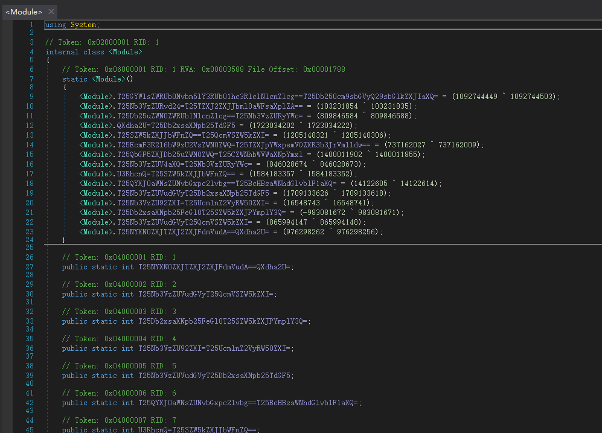

 - LocalVariables2Field(局部变量混淆为字段)

   使用本方法对您的程序函数的局部变量进行混淆加密，进一步降低代码可读性
   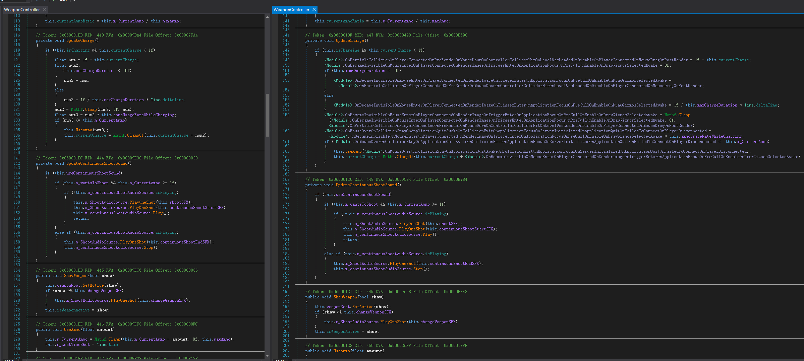

 - StringCrypt(字符串加密)

   使用本方法加密您游戏内的字符串常量，每一个字符串都单独对应一个单独和密码和单独的解密函数，使破解难度上升
   

 - ObfusFunc(类&方法&字段混淆)

   使用本方法加密您项目中所有的函数，类，甚至是参数，使程序的不可读性达到最高（我们采用了Unity函数名堆积作为字典，使得这种方法混淆的函数难以被反混淆器识别为Obfuscated或JunkFunc）

   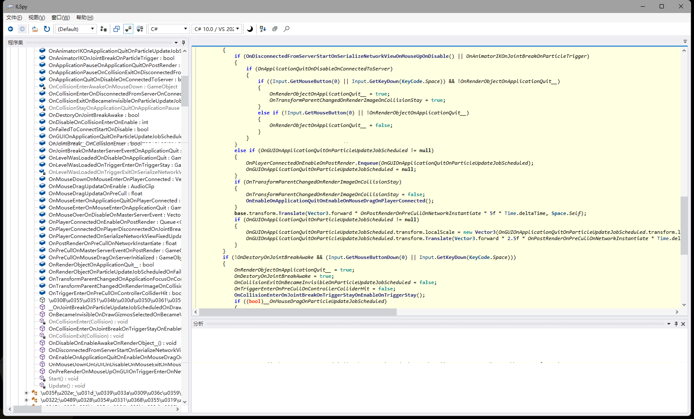

 - Anti-De4dot(侦测de4dot)

   使用本方法加固您的程序集，使得de4dot无法对齐完成还原以及反混淆

   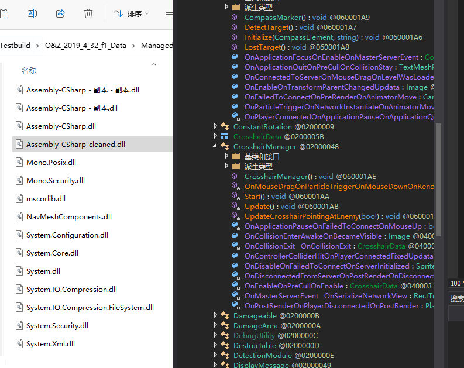

 - Anti-ILDASM(反反汇编器)
   
   使用本方法，通过MS提供的SuppressIldasmAttribute使反编译器无法正常工作

 - PEPacker(封装程序集,仅对mono编译方式有用)
   
   使用本方法，封装NET程序集，去除NET符号，使得反编译器无法正确识别NET程序集

  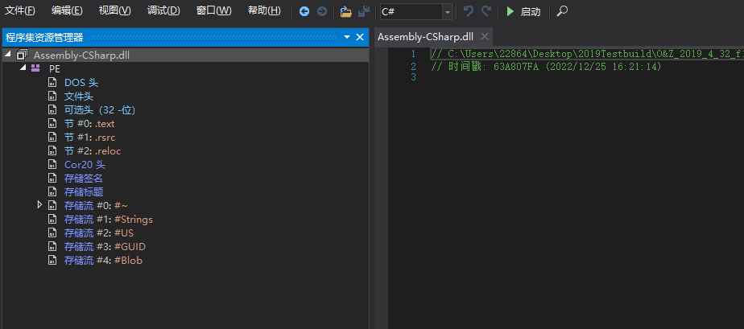

  - ErrorMethod(加固方法)
  
   使用本方法将加固您的方法使得Dnspy等反编译软件无法还原您的代码

   