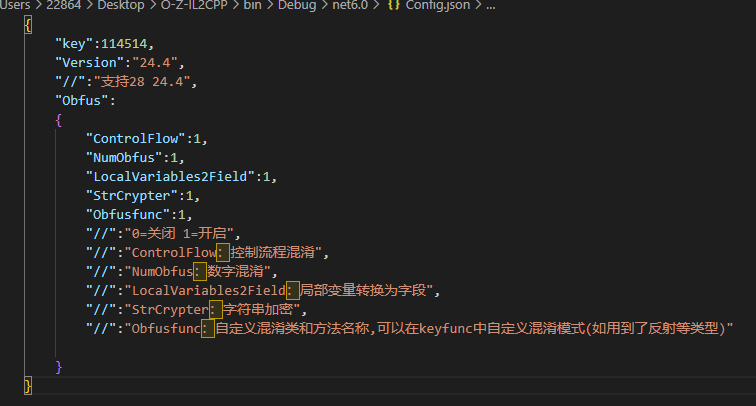
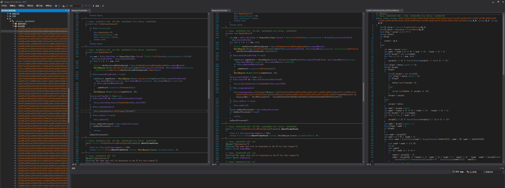
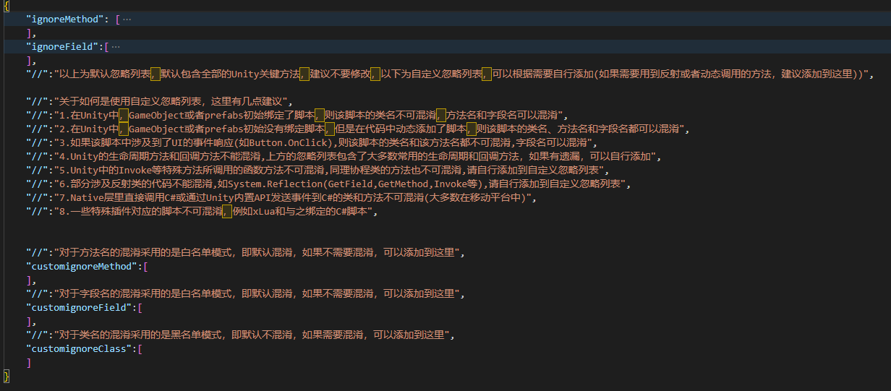
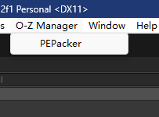

# O-Z-Mono Obfuscator

中文版本README请[戳我](README_zh-cn.md)

## Function List

|                       |Description|
|--------------------------|----|
|ControlFlow               |Confusing the execution process |
|NumObfus                  |Obfuscate num|
|LocalVariables2Field      |Convert local variables into fields|
|StringCrypt               |String encryption|
|ObfusFunc                 |Confuse the names of classes, fields, methods and parameters|
|Anti De4dot               |Invalidate De4dot|
|Anti Anti-ILDASM          |Invalidate disassembler|
|PEPacker                  |Removing the NET flag makes ILSpy, DnSpy and other software unable to correctly recognize the NET assembly|

> You can find out the detailed introduction and usage below
> 
## How to use O-Z-Mono Obfuscator 

> If you use our Unity plugin, please read from Article 5

1. Configure Config File
   
2. Use the parameter `MonoObfus` to encrypt your assembly
   ~~~
   O&Z_IL2CPP_Security.exe input MonoObfus

   for exzample:
   O&Z_IL2CPP_Security.exe D:\Myproject\Assembly-Csharp.dll MonoObfus
   ~~~
3. Enjoy Safe！ xD
4. If you want to use the ObfusFunc function to obtain more powerful confusion，Please carefully read the regulations in **Encryption Function Description - ObfusFunc**
5. For Unity users, we provide UnityPackage for you to use([click me to download](https://github.com/Z1029-oRangeSumMer/O-Z-IL2CPP/releases))
6. Configure your Config.Asset in unity(Located at the root of our plugin folder) **(Please carefully read each rule below)**
   
   
7. When everything is ready, you just need to build your project as usual, the script we provide will automatically help you complete everything! xD

## Encryption Function Description
 - ControlFlow

   Using this method will confuse the process of your program function method, without changing the execution process, it can disrupt the compilation process and the order of IL code, and can interfere with the work of the cracker
   

 - NumObfus
  
   Use this method to encrypt all int type preset constants in your assembly
   

 - LocalVariables2Field

   Use this method to convert the local variables of your program's functions into fields, reducing code readability
   

 - StringCrypt

   Use this method to encrypt the string constants in your game. Each string corresponds to a separate password and a separate decryption function, making it more difficult to crack
   

 - ObfusFunc

   Use this method to encrypt all functions, classes, and even parameters in your project to minimize the readability of the program（We use the key function name of Unity as the dictionary, making it difficult to identify the functions confused by this method as Obfuscated or JunkFunc）

   >See the bottom for rules of use

   

 - Anti-De4dot

   Invalidate De4dot

   

 - Anti-ILDASM
   
   Invalidate disassembler

 - PEPacker(only for Mono backend)
   
   Removing the NET flag makes ILSpy, DnSpy and other software unable to correctly recognize the NET assembly

  

   ### How to use ObfusFunc & Rules to note
   1. You need to configure `keyfunc.json` to adapt your project. For unit users, you can configure `Config.Asset` to adapt your project
   
   2. In `keyfunc.json`, we have preconfigured most of the life cycle functions and key callbacks in Unity, these will skip confusion **（We also configured these in Config. Asset of Unity）**
   3. We provide you with three customizable schemes for adapting your program
       - customignoreMethod: **This item adopts white list mode**，If you do not need to confuse a method or a method cannot be confused (for example, reflection is used), you can add the method name here
       - customignoreField: **This item adopts white list mode**，If you do not need to confuse a field or a field cannot be confused (for example, reflection is used), you can add the field name here
       - NeedObfuscateClass(customignoreClass): **This item adopts blacklist mode**,Because of the influence of the Unity preform, the class name cannot be confused generally (see below for detailed reasons). If you need to confuse a class name, you can add it here
   4. **Rules**
       - In Unity, GameObject or prefabs initially bind a script component, so the class name of the script cannot be confused, but the method name and field name can be confused
       - In Unity, GameObject or prefabs do not bind script components initially, but add components dynamically in the code, so the class name, method name and field name of the script can be confused
       - If the script involves UI event response (such as Button.OnClick), the class name and method name of the script cannot be confused, but the field name can be confused
       - The lifecycle method and callback method of Unity cannot be confused. The ignore list above contains most commonly used lifecycle and callback methods. If there are any omissions, you can add them yourself
       - Function methods called by special methods such as Invoke in Unity cannot be confused, nor can Coroutine. Please add these to the custom ignore list
       - Some codes involving Reflection cannot be confused, such as System. Reflection (GetField, GetMethod, Invoke, etc.). Please add them to the custom ignore list
       - The classes and methods that directly call C # in the Native layer or send events to C # through the Unity built-in API cannot be confused (most of them are in mobile platforms)
       - Some scripts bound to plug-ins should not be confused, such as xLua and C # scripts bound to it
       - You can write some key methods (such as in *game purchase, advertising control, game global management control, game resource management, game localization and storage, server cloud interaction, etc.*) into a script that does not involve Unity prefabrication or UI events, and confuse the class of the script
   5. The correct configuration of keyfunc.json can maximize the security of your game. Thank you for using it! If you have any questions, please contact my email or ask at issue
   6. For the PEPacker function, we currently only provide automatic processing for Mono backend on Windows platform (please manually use the PEPack function to confuse the assembly for Mono backend on Android platform or other platforms，**After replacing the file, don't forget to re sign your APK file**)
   
      > The Android platform needs to decompress the apk first, find the `Assembly-CSharp.dll`, handle it manually, and package your apk again and sign it

       

## How to use **O&Z Obfuscator** and how to deal with problems

1. Download our `UnityPackage` from [release](https://github.com/Z1029-oRangeSumMer/O-Z-IL2CPP/releases)
2. Configure `Config.json` and `KeyFunc.json` properly, just as configuring `O&Z-MonoObfuscator` (if you don't know how to configure,please find out in [O&Z-MonoObfuscator](O%26Z_Obfuscator/README.md))
3. You only need to build projects like normal ones, and O&Z will automatically help you complete the confusion of IL2CPP
4. There are still some bugs in this function. At present, the following points are known:
   - When you use O&Z IL2CPP Obfuscator to build your project, an error may occur in a function (and it may or may not occur during the construction, for example, an error may be reported during the construction of the same project, and it can be compiled in sequence later). This is caused by the random problem of ControlFlow. If you are patient, you can try several times. If you always report an error in a certain function, You can try to add the name of this function in Config.json, which will make ControlFlow skip this function, such as the following:

   - 

   - You can add the HandleShoot function to `ignore_ControlFlow_Method`

   - 
5. This function can confuse your project before IL2CPP is executed (the strength is equivalent to `O&Z Monoobfus`), which can make your project more secure when building cpp. Even if your program receives attacks like `il2cppdumper`, your methods and fields are still in a confused state, and the code file stored in `il2Cpp` is still confused by functions like `ControlFlow`, which reduces its readability and protects your game security to the greatest extent
   > The best effect can be obtained by cooperating with `O&Z-IL2CPP`