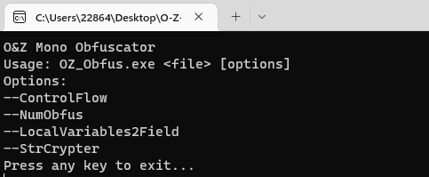

# O-Z-Mono Obfuscator
本次更新为测试更新,理论上支持任何版本的Mono程序集组件，如果有bug请联系作者

## 使用方法
1. 配置Config文件

   
2. 使用参数 **MonoObfus**  来加密你的dll程序集
   ~~~
   O&Z_IL2CPP_Security.exe input MonoObfus
   ~~~
3. Enjoy Safe！ xD
4. ~~您也可以直接使用命令行来操作加密你的NET程序集(*不仅是Unity Script，而是任何NET程序集!*)~~

   (此功能已删除,目前已经将主程序合并到O&Z_IL2CPP_Security.exe中)
   
   

## 加密参数说明
 - ControlFlow(控制流程加密)

   使用本方法将对您的程序函数方法进行流程混淆，不改变执行流程，但是可以打乱编译流程以及IL码的顺序，可以做到干扰破解
   

 - NumObfus(整数预设混淆)
  
   使用本方法将加密您程序集中的所有int类型预设常量（即明文数据，例如int num = 8, 8即为预设常量）
   

 - LocalVariables2Field(局部变量混淆为方法)

   使用本方法对您的程序函数的局部变量进行混淆加密，进一步降低代码可读性
   

 - StringCrypt(字符串加密)

   使用本方法加密您游戏内的字符串常量，每一个字符串都单独对应一个单独和密码和单独的解密函数，使破解难度上升
   

   
