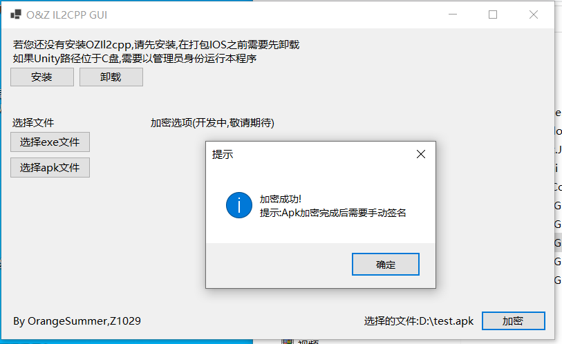

# OZ-IL2CPP-GUI

## 加密流程

1. 我们重新定义和声明了新的Header并且将他们加密后隐藏在了文件之中使得破解者获取获取原始Header的过程变得困难
2. 我们混淆了Header并且隐藏了sanity和verison等关键参数，使得IL2CPPDumper等软件无法正确识别Metadata文件

即将加入:加密Metadata内的String和StringLiteral部分

## 使用方法

1. 下载源代码并使用VS编译项目,或者直接下载[Release](https://github.com/Z1029-oRangeSumMer/O-Z-IL2CPP/releases)
2. 确保已经安装net6.0
3. 运行OZ_IL2CPP_GUI.exe

4. 点击安装, 选择对应的Unity.exe, 安装路径可在Unity Hub中找到
5. 进入Unity, 在BuildSettings中将脚本后端改为Il2cpp, 构建项目
6. 点击**选择exe文件**或**选择apk文件**, 选择刚刚构建出的游戏, 点击**加密**
7. 如果是apk, 加密完成后需要手动签名, exe则直接运行即可 (如果此时软件无法运行, 欢迎前往issue反馈bug)
8. 享受**O&Z IL2cpp**给你带来的安全! :D

## Support Unity Version

| Il2Cpp Version | Unity Version                | Support        |
| -------------- | ---------------------------- |--------------  |
| 24.0           | 2017.x - 2018.2.x            |✔️              |
| 24.1           | 2018.3.x - 2018.4.x          |✔️              |
| 24.2           | 2019.1.x - 2019.2.x          |✔️              |
| 24.3           | 2019.3.x, 2019.4.x, 2020.1.x |✔️             |
| 24.4           | 2019.4.x and 2020.1.x        |✔️             |
| 27.0           | 2021.2.x                     |✔️              |
| 27.1           | 2020.2.x - 2020.3.x          | ✔️              |
| 27.2           | 2021.1.x, 2021.2.x           |✔️              |
| 28             | 2021.3.x, 2022.1.x           |✔️             |
