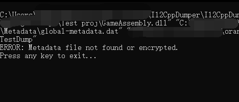
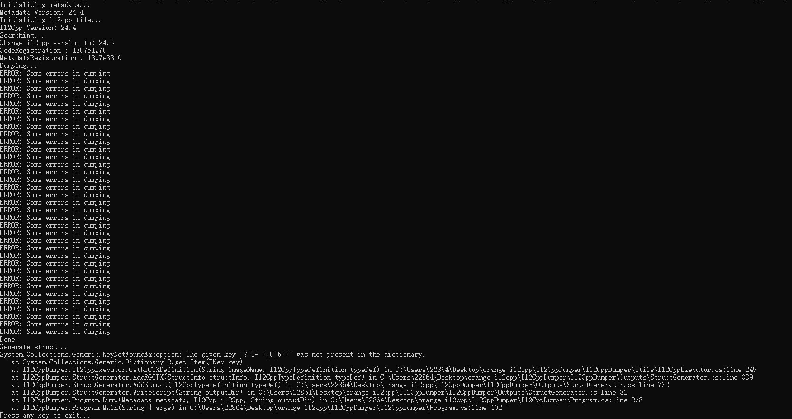
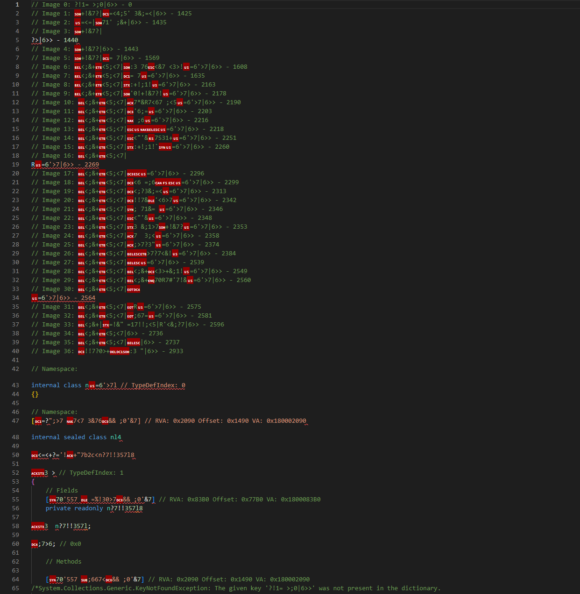
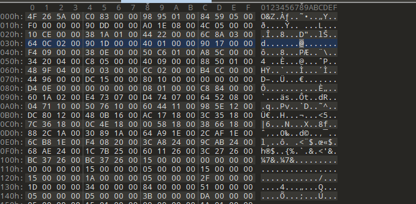

# O-Z-IL2CPP
O&Z IL2cpp 是由 **Z1029[QQ:3408708525]** **和[oRangeSumMer](https://space.bilibili.com/79045701)[QQ:2286401259]** 共同制作的针对Unity IL2CPP编译进行的客制化和加密

本项目目前只针对 **Unity 2019.4.32f1 (64-bit)** (IL2CPP Version:24.4)起作用，之后会逐步适配其他版本的unity engine

交流群：957552913（QQ）
## 加密流程
1. 混淆了IL2CPP Header使得大部分Dumper软件无法正确识别Metadata
2. 加密Metadata内的String部分防止关键的类和方法名被获取，这同样适用于防止IL2CPPDumper的攻击（即使头部的混淆失效，同样可以提供二次保护）
3. 加密Metadata内的StringLiteral部分，防止您的游戏文本或者字符串密钥等关键字符串受到攻击

## 加密效果
Il2CPP Dumper测试效果

模拟受到攻击,攻击者还原头部之后

还原头部后由IL2CPPDumper获取的Dump.cs展示

原始头部

混淆后的头部

## 使用方法
1. 编译出VS工程,或者直接下载[Release](https://github.com/Z1029-oRangeSumMer/O-Z-IL2CPP/releases)内的exe程序
2. 首先对Unity工程进行一次生成，得到原始的 **globa-metadata.dat** 文件 *(一般位于 你的项目名称_Data\il2cpp_data\Metadata\ 文件夹内)*
3. 在生成的可执行文件的文件夹内使用命令行，你将得到加密后的Metadata文件

~~~
"O&Z_IL2CPP_Security" 原始global-metadata.dat文件路径 Crypt 加密后输出文件的路径

例如 "O&Z_IL2CPP_Security" "global-metadata.dat" Crypt "global-metadata.dat.crypted"
~~~
4. 使用 **\Unity il2cpp code\Unity 2019.4.32f1 (64-bit)\MetadataCache.cpp** 替换掉Unity安装目录下的同名文件 **\Unity 2019.4.32f1\Editor\Data\il2cpp\libil2cpp\vm\MetadataCache.cpp**
5. 使用 **\Unity il2cpp code\Unity 2019.4.32f1 (64-bit)\il2cpp-metadata.h** 替换掉Unity安装目录下的同名文件 **\Unity 2019.4.32f1\Editor\Data\il2cpp\libil2cpp\il2cpp-metadata.h**
6. 再次启动Unity，重新生成一遍需要加密的项目
7. 使用加密后的 Metadata 文件替换掉新生成项目下的 **globa-metadata.dat**文件
8. 享受**O&Z IL2cpp**给你带来的安全! :D

## 更新预告
在下一个版本中，我们会做出如下更新（可能）
1. 重定位Header在Metadata中的位置（甚至是重构Metadata Loader System）
2. 将Metadata整体进行加密
3. ......

敬请期待 awa！

## 联系作者
如果你有任何问题或者建议，可以联系作者的QQ账号进行反馈哦！

也可以直接在issue提问

期待你的建议！