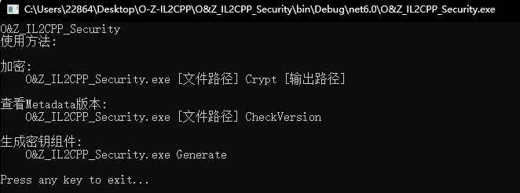
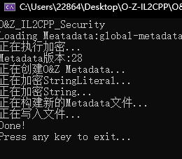
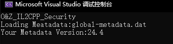
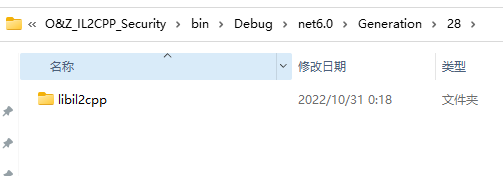

# O-Z-IL2CPP
O&Z IL2cpp 是由 **Z1029[QQ:3408708525]** **和[oRangeSumMer](https://space.bilibili.com/79045701)[QQ:2286401259]** 共同制作的针对Unity IL2CPP编译进行的客制化和加密

交流群：957552913（QQ）

***本程序基于Net6.0开发，运行需要Net6.0环境，请确保您的PC正确安装了NET6 Runtime或者NET6 SDK***
# Support Unity Version

| Il2Cpp Version | Unity Version                | Support        |
| -------------- | ---------------------------- |--------------  |   
| 24.0           | 2017.x - 2018.2.x            |                |
| 24.1           | 2018.3.x - 2018.4.x          |                |
| 24.2           | 2019.1.x - 2019.2.x          |                |
| 24.3           | 2019.3.x, 2019.4.x, 2020.1.x |✔️             |
| 24.4           | 2019.4.x and 2020.1.x        |✔️             |
| 27.0           | 2021.2.x                     |                |
| 27.1           | 2020.2.x - 2020.3.x          |                |
| 27.2           | 2021.1.x, 2021.2.x           |                |
| 28             | 2021.3.x, 2022.1.x           |✔️             |

如果需要了解您使用的unity Metadata版本，可以使用CheckVersion参数来查看您的Metadata版本 *（具体方法在下方）*

***如果你想让我们添加对您使用的Unity版本的支持，可以联系作者QQ哦***

## What's New
1. ~~本次我们对程序的整体代码进行了修剪和优化，同时优化了用户交互体验~~

2. 开始了 **O&Z_Obfuscator** 的开发!(目前实现了 **数字型常量加密** )
   

>新增的帮助界面

>

>详细的执行流程

>

1. 我们新增了Config配置文件,可以直接在Config内配置相关参数,**并且我们本次更新支持自定义key**
   
   ***详细使用方法请阅读下方的使用方法***

>

3. 我们修复了代码中错误的表述信息,并且修复了release中应用程序无法正常运行的问题
> 将IL2CPP版本修改为Metadata版本 
> 
> 2019.4 修正为 v24，2021.1 修正为 v28

## 预告
1. UI窗口界面即将完成！

预告指的是在近期版本会更新的条目，更多长期目标可以查看下文的未来规划 ***qwq***
## 加密流程
1. 我们重新定义和声明了新的Header并且将他们加密后隐藏在了文件之中使得破解者获取获取原始Header的过程变得困难（此次改动基于第4条的混淆Header）
2. 加密Metadata内的String部分防止关键的类和方法名被获取，这同样适用于防止IL2CPPDumper的攻击（即使头部的混淆失效，同样可以提供二次保护）
3. 加密Metadata内的StringLiteral部分，防止您的游戏文本或者字符串密钥等关键字符串受到攻击
4. 我们混淆了Header并且隐藏了sanity和verison等关键参数，使得IL2CPPDumper等软件无法正确识别Metadata文件

## 加密效果
Il2CPP Dumper测试效果

模拟受到攻击,攻击者还原头部之后

还原头部后由IL2CPPDumper获取的Dump.cs展示

Origin_Header

O&Z_Header

## 使用方法
1. 下载源代码并使用VS编译项目,或者直接下载[Release](https://github.com/Z1029-oRangeSumMer/O-Z-IL2CPP/releases)内的exe程序
2. 首先打开 Config.json 正确配置您的Metadata版本 *(关于Unity对应版本图可以在上方查看)*
   >也可以使用**CheckVersion**参数查看您的Metadata版本(需要提前生成一次您的工程以获取Metadata原始文件)

~~~
O&Z_IL2CPP_Security Input CheckVersion

例如:
O&Z_IL2CPP_Security global-metadata.dat CheckVersion
~~~

1. 设置您的key以用于加密Metadata **(不可以超过int类型的最高上限)**
   >

2. 使用**Generate**参数生成配套的加密组件

~~~
O&Z_IL2CPP_Security Generate
~~~

>生成成功后，你可以在 *Generation\您的Metadata版本\\* 文件夹下找到对应组件(组件为**整个目录/文件夹**)

>

>***tips: src-res文件夹内为组件模型，请不要去修改或者移动以防止出错***

5. 将生成的组件覆盖进入Unity的IL2CPP文件夹(**\Unity XXXXX\Editor\Data\il2cpp\libil2cpp\\**)内

6. 启动Unity，重新生成一遍需要加密的项目
7. 提取出生成项目的Metadata文件(global-metadata.dat)，使用**Crypt**参数加密此文件
~~~
"O&Z_IL2CPP_Security" input Crypt output

例如 "O&Z_IL2CPP_Security" "global-metadata.dat" Crypt "global-metadata.dat.crypted"
~~~
8. 将加密输出的文件重命名为原始Metadata文件的名称并且替换掉原来的Metadata文件
9. 享受**O&Z IL2cpp**给你带来的安全! :D

## 未来的规划
1. 对AssetBundle资源进行加密
2. 修改IL2CPP的运行机制
3. 对原始Assembly-Csharp.dll进行混淆
4. . . . . . .

敬请期待 awa！

## 联系作者
如果你有任何问题或者建议，可以联系作者的QQ账号进行反馈哦！

也可以直接在issue提问

期待你的建议！
