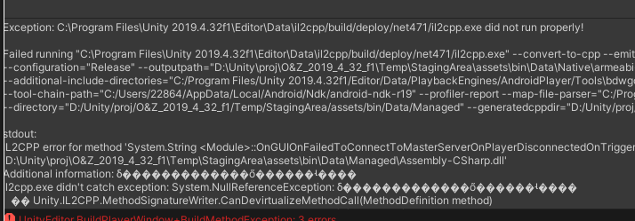

# O-Z-Unity Protector

O&Z Protector 是由 **Z1029[QQ:3408708525]** **和[oRangeSumMer](https://space.bilibili.com/79045701)[QQ:2286401259]** 共同制作的针对Unity进行的客制化和加密

交流群：957552913（QQ）

***本程序基于[Net6.0](https://dotnet.microsoft.com/zh-cn/download/dotnet/6.0) & [NETFramework4.8](https://dotnet.microsoft.com/zh-cn/download/dotnet-framework/net48)开发，运行需要[Net6.0](https://dotnet.microsoft.com/zh-cn/download/dotnet/6.0) & [NETFramework4.8](https://dotnet.microsoft.com/zh-cn/download/dotnet-framework/net48)环境，请确保您的PC正确安装了NET Runtime或者NET SDK***

## >>>[O&Z-IL2CPP(Click me!)](O%26Z_IL2CPP_Security/README.md)<<<

## >>>[O&Z-MonoObfuscator(Click me!)](O%26Z_Obfuscator/README.md)<<<

## What's New (O&Z IL2CPP Obfuscator and OZ_Il2cpp_Console Released!)
1. 本次更新为预备更新，我们尝试将mono obfus功能集成到IL2CPP上，并且取得了成功(具体使用方法如下)
   > ***现在你可以同时享受O&Z-IL2CPP和O&Z-MonoObfuscator的双倍安全***

   > 即使O&Z-IL2CPP暂时还没有适配您使用的Unity版本,您同样可以使用**O&Z IL2CPP Obfuscator**，因为O&Z IL2CPP Obfuscator目前支持**2019.4之后的所有Unity版本**

2. 在MonoObfuscate功能中，我们添加了对类，方法，字段名的混淆是的代码的不可读性和破解难度上升到了最高，而且此方法可以兼容Unity（需要自定义配置keyfunc.json文件）！
   
   
3. ***OZ_Il2cpp_Console***是一个实验性功能, 我们尝试自动生成Libil2cpp，并已经成功
   > 只要您没有修改过Libil2cpp, ***OZ_Il2cpp_Console***就支持您使用的Unity版本, 不过安全性暂时不如原版本
   
   > 由于是实验性功能, 如果不能支持您的Unity版本, 欢迎提出Issue
   
   > 您可以通过手动恢复bak备份文件来还原Libil2cpp
   
   > 我们正在研发控制台程序所对应的窗口程序, 敬请期待
   

## 关于O&Z IL2CPP Obfuscator的使用方法
1. 从[Release](https://github.com/Z1029-oRangeSumMer/O-Z-IL2CPP/releases)中下载我们的unitypackage
2. 正确的配置**Config.json**和**KeyFunc.json**,就像你配置O&Z-MonoObfuscator那样(如不明白配置,可以跳转到[O&Z-MonoObfuscator](O%26Z_Obfuscator/README.md)了解)
3. 您只需要像正常的构建生成项目一样，O&Z 会自动帮你完成IL2CPP的混淆
4. 当然，在预更新阶段，本功能还存在一些bug，目前已知有以下几点
   - 使用O&Z IL2CPP Obfuscator构建您的项目时，可能会出现某一个函数的报错(而且是构建时可能发生，也可能不发生，例如同一工程构建时候报错了，过一会又可以顺序编译了)，这是由于ControlFlow的随机问题造成的，如果您有耐心可以多尝试几次，如果一直在某一个报错，可以尝试在Config.json中添加该函数的名称，这样会让ControFlow跳过这个函数,例如以下这种情况
   
   可以将HandleShoot函数添加到**ignore_ControlFlow_Method**中
   
   - 在构建Android项目时，你可能会出现下方的报错，这个bug目前仅存在Android平台，且暂时未知原因(仅知道他是来自StringCrypt)，因此如果您在构建Android项目时出现了下方的报错，请禁用StringCrypt
   
5. 本功能可以在IL2CPP执行之前对您的项目进行一次混淆(强度等同于O&Z Monoobfus)，可以使您的项目构建cpp时更加安全，即使您的程序收到了il2cppdumper之类的攻击，您的方法和字段任然处于混淆状态，而且il2cpp储存的代码文件任然被ControlFlow等功能混淆，使其可读性降低，最大程度保护您的游戏安全
   > 配合**O&Z-IL2CPP**可以获得最佳效果哦
## 预告
1. UI窗口界面即将完成！
2. 正在测试对于所有unity版本il2cpp的支持,自动生成libil2cpp
3. 我们准备重写Mono虚拟机，在底层对Unity Mono的JIT，AOT等进行加密
4. ~~我们正在尝试对于IL2CPP生成方式中，在生成IL代码时，插入MonoObfuscate的功能，使得IL2CPP获得最佳保险~~

## 未来的规划
1. 对AssetBundle资源进行加密
2. 修改IL2CPP的运行机制
3. 对原始Assembly-Csharp.dll进行混淆
4. ***我们正式准备上架Unity AssetStore啦!**
5. . . . . . .

敬请期待 awa！

## 联系作者
如果你有任何问题或者建议，可以联系作者的QQ账号进行反馈哦！

也可以直接在issue提问

期待你的建议！
