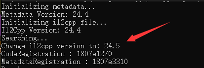

# O-Z-IL2CPP
O&Z IL2cpp 是由 **Z1029[QQ:3408708525]** **和[oRangeSumMer](https://space.bilibili.com/79045701)[QQ:2286401259]** 共同制作的针对Unity IL2CPP编译进行的客制化和加密

~~本项目目前只针对 **Unity 2019.4.32f1 (64-bit)** (IL2CPP Version:24.4)起作用，之后会逐步适配其他版本的unity engine~~

> 支持的Unity版本: 
> - **Unity 2019.4.32f1 (64-bit)** 及其同期使用 **IL2CPP V24.5** 的Unity版本
> - **Unity 2021.3.6f1** 及其同期使用 **IL2CPP V29** 的Unity版本

同时并非Unity版本与我们的版本不同就无法使用，只需要您使用的Unity的IL2CPP版本与我们的版本相同即可使用，如果需要了解您使用的unity IL2CPP版本，可以使用il2cpp dumper等工具对您的原始demo进行dump测试即可得知您的IL2CPP版本

交流群：957552913（QQ）

## What's New
1. ~~此次更新为正式版本最后一次预更新，我们对代码的结构和核心功能进行了二次优化了调整，对于其他IL2CPPVersion的兼容也在进行中，敬请期待！~~
2. 我们添加了对 **Unity 2021.3.6f1(IL2CPP v29)** 的正式支持！
3. 将Header部分替换为我们提供的Header，并且将原始的Header加密后隐藏在文件中，使破解者寻找到原始Header的过程变得困难
4. 优化和独立核心代码，你也可以仿照我们的方式对proj进行修改，自行添加对您的unity version的支持！

***如果你想让我们添加对您使用的Unity版本的支持，可以联系作者QQ哦***

## 预告
1. 我们会在之后的版本中提供检测您的IL2CPP_Version的功能（coming soon！）
2. 我们会在近期更新中重构IL2CPP的结构体
3. ~~目前已对整体的Core进行了优化与独立，为兼容其他的unity版本作了重要铺垫，我们将会在下一个版本中提供对 **Unity 2021.3.6f1(IL2CPP Version:29)** 的支持，我们欢迎你加入我们的群聊或者联系作者QQ提出宝贵的建议或者提出对你正在使用的unity版本的适配~~
4. ***我们正在开发UI版本以及Json配置等功能(可以自定义加密流程，以及密钥等)***

预告指的是在近期版本会更新的条目，更多长期目标可以查看下文的未来规划 ***qwq***
## 加密流程
1. 我们重新定义和声明了新的Header并且将他们加密后隐藏在了文件之中使得破解者获取获取原始Header的过程变得困难（此次改动基于第4条的混淆Header）
2. 加密Metadata内的String部分防止关键的类和方法名被获取，这同样适用于防止IL2CPPDumper的攻击（即使头部的混淆失效，同样可以提供二次保护）
3. 加密Metadata内的StringLiteral部分，防止您的游戏文本或者字符串密钥等关键字符串受到攻击
4. 我们混淆了Header并且隐藏了sanity和verison等关键参数，使得IL2CPPDumper等软件无法正确识别Metadata文件
5. ~~对Metadata整体进行加密，增加破解者的破解难度和破解成本（解密部分暂未实现，暂时不可用）~~
6. ~~新增对AssetBundle的加密方法（解密部分暂未实现，暂时不可用）~~

## 加密效果
Il2CPP Dumper测试效果

模拟受到攻击,攻击者还原头部之后

还原头部后由IL2CPPDumper获取的Dump.cs展示

Origin_Header

O&Z_Header

## 使用方法
1. 编译出VS工程,或者直接下载[Release](https://github.com/Z1029-oRangeSumMer/O-Z-IL2CPP/releases)内的exe程序
2. 首先对Unity工程进行一次生成，得到原始的 **globa-metadata.dat** 文件 *(一般位于 你的项目名称_Data\il2cpp_data\Metadata\ 文件夹内)*
3. 在生成的可执行文件的文件夹内使用命令行，并且正确输入您的IL2CPP版本,你将得到加密后的Metadata文件

~~~
"O&Z_IL2CPP_Security" 原始global-metadata.dat文件路径 Crypt 加密后输出文件的路径

例如 "O&Z_IL2CPP_Security" "global-metadata.dat" Crypt "global-metadata.dat.crypted"

Please input your il2cpp version(v24.5/v29):
v24

~~~
4. 使用 **libil2cpp** 覆盖Unity安装目录下的同名文件夹 **\Unity XXXXX\Editor\Data\il2cpp\libil2cpp\\**
5. 再次启动Unity，重新生成一遍需要加密的项目
6. 使用加密后的 Metadata 文件替换掉新生成项目下的 **globa-metadata.dat**文件
7. 享受**O&Z IL2cpp**给你带来的安全! :D

## 未来的规划
1. ~~重定位Header在Metadata中的位置（甚至是重构Metadata Loader System）~~
2. ~~将Metadata整体进行加密~~
3. 对AssetBundle资源进行加密
4. 修改IL2CPP的运行机制
5. 对原始Assembly-Csharp.dll进行混淆
6. . . . . . .

敬请期待 awa！

## 联系作者
如果你有任何问题或者建议，可以联系作者的QQ账号进行反馈哦！

也可以直接在issue提问

期待你的建议！
