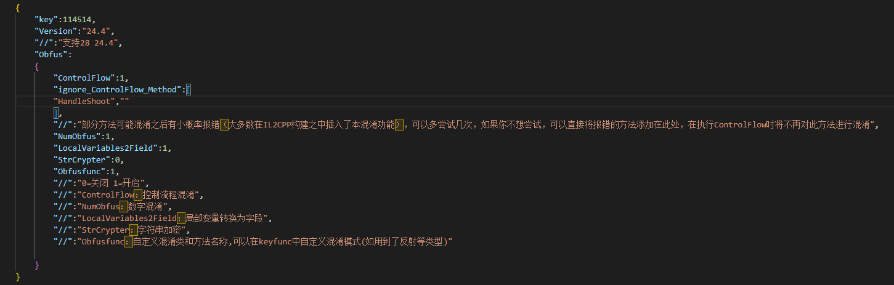

# O-Z-Unity Protector

O&Z Protector 是由 **Z1029[QQ:3408708525]** **和[oRangeSumMer](https://space.bilibili.com/79045701)[QQ:2286401259]** 共同制作的针对Unity进行的客制化和加密

交流群：957552913（QQ）

***本程序基于[Net6.0](https://dotnet.microsoft.com/zh-cn/download/dotnet/6.0) & [NETFramework4.8](https://dotnet.microsoft.com/zh-cn/download/dotnet-framework/net48)开发，运行需要[Net6.0](https://dotnet.microsoft.com/zh-cn/download/dotnet/6.0) & [NETFramework4.8](https://dotnet.microsoft.com/zh-cn/download/dotnet-framework/net48)环境，请确保您的PC正确安装了NET Runtime或者NET SDK***

## >>>[O&Z-IL2CPP(Click me!)](OZ_IL2CPP_GUI)<<<

## >>>[O&Z-MonoObfuscator(Click me!)](O%26Z_Obfuscator)<<<

## >>>[O&Z-Auto Generate Console(Click me!)](OZ_Il2cpp_Console)<<<

## What's New (**O&Z IL2CPP Obfuscator 重大更新!** && O&Z_Il2cpp_Console Released!)
1. 本次更新添加了UnityPackage功能,现在您可以导入我们的[UnityPackge](https://github.com/Z1029-oRangeSumMer/O-Z-IL2CPP/releases)，在unity的可视化界面配置您的加密方案
   > ***现在你可以同时享受O&Z-IL2CPP和O&Z-MonoObfuscator的双倍安全***

   >详细的使用方法请看[O&Z-MonoObfuscator(Click me!)](O%26Z_Obfuscator)

   

2. 我们下放了对Unity版本的适配,现在我们的混淆器可以支持到2018.2后的所有版本

   > 即使O&Z-IL2CPP暂时还没有适配您使用的Unity版本,您同样可以使用**O&Z IL2CPP Obfuscator**，因为O&Z IL2CPP Obfuscator目前支持**2018.2之后的所有Unity版本**

3. 在MonoObfuscate功能中，我们添加了侦测 **De4dot** 反混淆器的侦测,通过配置Anti-de4dot功能可以使您的程序集无法被de4dot还原！同时也加入了PEPack功能，该功能可以去除您的NET程序集标志使得您的程序集无法被反编译器识别(*请看下方图片*)
   
|New                       |说明|
|--------------------------|----|
|Anti De4dot               |使得反混淆器失效|
|Anti Anti-ILDASM          |使得反汇编器失效|
|PEPacker                  |去除NET标志使得ILSpy，DnSpy等软件无法正确识别NET程序集|

   > after de4dot: 

   > 
   
   > after PEPacker

   > 

1. ***OZ_Il2cpp_Console***我们成功开发了**Auto-Genertate IL2cpp**功能,并且取得了成功(暂时处于测试阶段),现在你可以使用O&Z IL2CPP加密任何版本的Unity! 
   
   **支持的Unity版本**

   | Il2Cpp Version | Unity Version                | Support        |
   | -------------- | ---------------------------- |--------------  |   
   | 24.0           | 2017.x - 2018.2.x            | ✔️             |
   | 24.1           | 2018.3.x - 2018.4.x          | ✔️             |
   | 24.2           | 2019.1.x - 2019.2.x          | ✔️             |
   | 24.3           | 2019.3.x, 2019.4.x, 2020.1.x |✔️              |
   | 24.4           | 2019.4.x and 2020.1.x        |✔️              |
   | 27.0           | 2021.2.x                     | ✔️             |
   | 27.1           | 2020.2.x - 2020.3.x          | ✔️             |
   | 27.2           | 2021.1.x, 2021.2.x           | ✔️             |
   | 28             | 2021.3.x, 2022.1.x           |✔️              |

   > ***OZ_Il2cpp_Console*** 支持任何原版本的Unity(未经过修改的)
   
   > 如果对您的Unity版本出现不兼容或者存在Bug，欢迎提出issue或者联系z9(Q:3408708525)
   
   > ***在测试该项功能前,别忘了手动备份您的libil2cpp文件,避免造成不便xD***
   

## 关于O&Z IL2CPP Obfuscator的使用方法以及问题处理
1. 从[Release](https://github.com/Z1029-oRangeSumMer/O-Z-IL2CPP/releases)中下载我们的unitypackage
2. 正确的配置**Config.json**和**KeyFunc.json**,就像你配置O&Z-MonoObfuscator那样(如不明白配置,可以跳转到[O&Z-MonoObfuscator](O%26Z_Obfuscator/README.md)了解)
3. 您只需要像正常的构建生成项目一样，O&Z 会自动帮你完成IL2CPP的混淆
4. 本功能还存在一些bug，目前已知有以下几点
   - 使用O&Z IL2CPP Obfuscator构建您的项目时，可能会出现某一个函数的报错(而且是构建时可能发生，也可能不发生，例如同一工程构建时候报错了，过一会又可以顺序编译了)，这是由于ControlFlow的随机问题造成的，如果您有耐心可以多尝试几次，如果一直在某一个报错，可以尝试在Config.json中添加该函数的名称，这样会让ControFlow跳过这个函数,例如以下这种情况
   
   可以将HandleShoot函数添加到**ignore_ControlFlow_Method**中
   
5. 本功能可以在IL2CPP执行之前对您的项目进行一次混淆(强度等同于O&Z Monoobfus)，可以使您的项目构建cpp时更加安全，即使您的程序收到了il2cppdumper之类的攻击，您的方法和字段任然处于混淆状态，而且il2cpp储存的代码文件任然被ControlFlow等功能混淆，使其可读性降低，最大程度保护您的游戏安全
   > 配合**O&Z-IL2CPP**可以获得最佳效果哦
## 预告
1. ~~UI窗口界面即将完成！~~
2. ~~正在测试对于所有unity版本il2cpp的支持,自动生成libil2cpp~~
3. *我们准备重写Mono虚拟机，在底层对Unity Mono的JIT，AOT等进行加密*

## 未来的规划
1. 对AssetBundle资源进行加密
2. 修改IL2CPP的运行机制
3. 我们正常尝试对MonoBehave类进行修改以实现对Class的混淆
4. ***我们正式准备上架Unity AssetStore啦!***
5. . . . . . .

敬请期待 awa！

## 特别鸣谢
本项目参考的项目以及工程案例具体如下，对各位开源作者致以最高的感谢!

- [dnlib](https://github.com/0xd4d/dnlib)
- [MindLate](https://github.com/Sato-Isolated/MindLated)
- [ConfuserEx](https://github.com/yck1509/ConfuserEx)
- BeeByte Obfuscation
- BitMono
- [BitDotNet(PEPacker)](https://github.com/0x59R11/BitDotNet)

## 联系作者
如果你有任何问题或者建议，可以联系作者的QQ账号进行反馈哦！

也可以直接在issue提问

期待你的建议！
