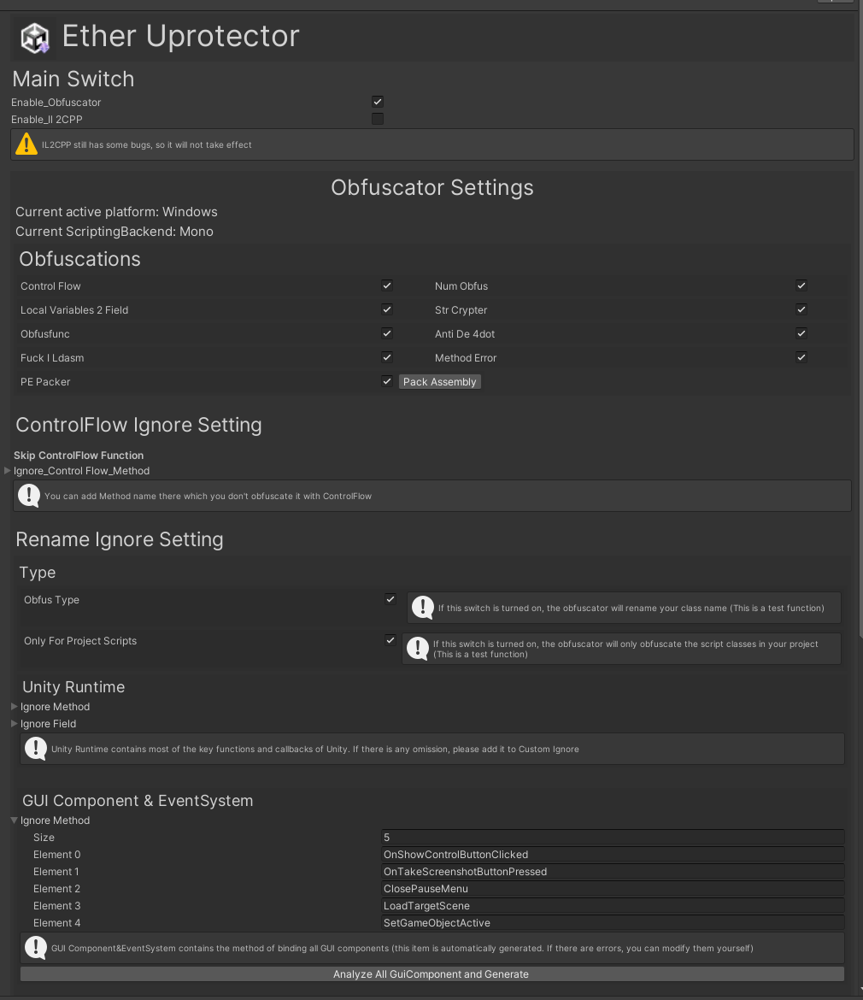
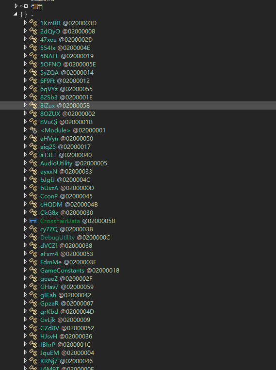
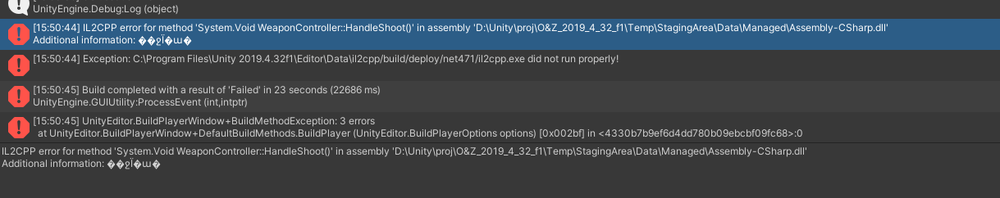

-2286401259-green) -3408708525-green)   

Ether Uprotector 是由 **Ether Team** 维护的针对Unity进行的客制化和加密

交流群：957552913（QQ）

***本程序基于[Net6.0](https://dotnet.microsoft.com/zh-cn/download/dotnet/6.0) & [NETFramework4.8](https://dotnet.microsoft.com/zh-cn/download/dotnet-framework/net48)开发，运行需要[Net6.0](https://dotnet.microsoft.com/zh-cn/download/dotnet/6.0) & [NETFramework4.8](https://dotnet.microsoft.com/zh-cn/download/dotnet-framework/net48)环境，请确保您的PC正确安装了NET Runtime或者NET SDK***

# Project List
- [Ether_Obfuscator](Ether_Obfuscator)
- [Ether_IL2CPP_Auto](Ether_IL2CPP_Auto)
- ~~[[Obsolete]Ether_IL2CPP_GUI](Ether_IL2CPP_GUI)~~
- ~~[[Obsolete]Ether-IL2CPP](Ether_IL2CPP)~~

## 如何开始
[点我](Ether_Obfuscator)了解如何开始使用并且正确配置Ether Uprotector

## What's New
1. 全新的UI配置界面,让你的配置更加简单
2. 自动分析项目并且根据项目生成配置(涵盖`GUI`,`Animation`以及`Reflection`),**自动生成**需要忽略的方法名以及字段名

   
 
3. 支持混淆`monobehaviour`类名

   

4. `EtherIL2CPP`任然存在bug，我们会修复他们并且将在`v1.61`版本正式发布新版的EtherIL2CPP
   
## 关于Ether_Obfuscator问题处理
1. ControlFlow功能可能存在bug,如果Unity抛出异常，可以尝试关闭ControlFlow功能
2. 如果在IL2CPP构建过程中个别方法抛出异常
   
   可以将HandleShoot函数添加到**ignore_ControlFlow_Method**中
   

## 预告
1. 我们正在规划并且制作`AssetProtection`

## 未来的规划
1. 对AssetBundle资源进行加密
2. 修改IL2CPP的运行机制
3. ***我们正式准备上架Unity AssetStore啦!***
4. . . . . . .

敬请期待 awa！

## 特别鸣谢
本项目参考的项目以及工程案例具体如下，对各位开源作者致以最高的感谢!

- [dnlib](https://github.com/0xd4d/dnlib)
- [MindLate](https://github.com/Sato-Isolated/MindLated)
- [ConfuserEx](https://github.com/yck1509/ConfuserEx)
- BeeByte Obfuscation
- [BitMono](https://github.com/sunnamed434/BitMono)
- [BitDotNet(PEPacker)](https://github.com/0x59R11/BitDotNet)

## 联系作者
如果你有任何问题或者建议，可以联系作者的QQ账号进行反馈哦！

也可以直接在issue提问

期待你的建议！
